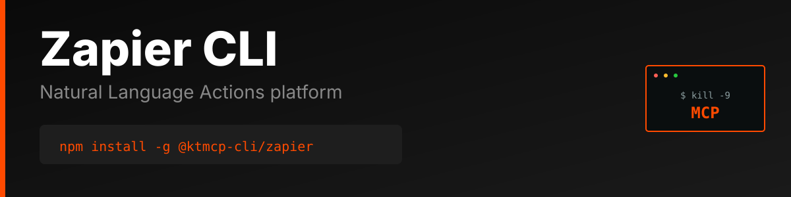

> "Six months ago, everyone was talking about MCPs. And I was like, screw MCPs. Every MCP would be better as a CLI."
>
> — [Peter Steinberger](https://twitter.com/steipete), Founder of OpenClaw
> [Watch on YouTube (~2:39:00)](https://www.youtube.com/@lexfridman) | [Lex Fridman Podcast #491](https://lexfridman.com/peter-steinberger/)

# Zapier CLI

Production-ready command-line interface for the [Zapier Natural Language Actions API](https://nla.zapier.com/) - Execute automation workflows from the command line.

> **⚠️ Unofficial CLI** - This tool is not officially sponsored, endorsed, or maintained by Zapier. It is an independent project built on the public Zapier NLA API. API documentation: https://nla.zapier.com/docs/

## Features

- Execute Zapier actions from the command line
- List all available Natural Language Actions
- Simple action execution with JSON parameters
- JSON and pretty-print output formats
- Persistent configuration storage
- Progress indicators for long-running operations

## Why CLI > MCP

### The MCP Problem

Model Context Protocol (MCP) servers introduce unnecessary complexity and failure points for API access:

1. **Extra Infrastructure Layer**: MCP requires running a separate server process that sits between your AI agent and the API
2. **Cognitive Overhead**: Agents must learn MCP-specific tool schemas on top of the actual API semantics
3. **Debugging Nightmare**: When things fail, you're debugging three layers (AI → MCP → API) instead of two (AI → API)
4. **Limited Flexibility**: MCP servers often implement a subset of API features, forcing you to extend or work around limitations
5. **Maintenance Burden**: Every API change requires updating both the MCP server and documentation

### The CLI Advantage

A well-designed CLI is the superior abstraction for AI agents:

1. **Zero Runtime Dependencies**: No server process to start, monitor, or crash
2. **Direct API Access**: One hop from agent to API with transparent HTTP calls
3. **Human + AI Usable**: Same tool works perfectly for both developers and agents
4. **Self-Documenting**: Built-in `--help` text provides complete usage information
5. **Composable**: Standard I/O allows piping, scripting, and integration with other tools
6. **Better Errors**: Direct error messages from the API without translation layers
7. **Instant Debugging**: `--json` gives you the exact API response for inspection

**Example Complexity Comparison:**

MCP approach:
```
AI Agent → MCP Tool Schema → MCP Server → HTTP Request → API → Response Chain (reverse)
```

CLI approach:
```
AI Agent → Shell Command → HTTP Request → API → Direct Response
```

The CLI is simpler, faster, more reliable, and easier to debug.

## Installation

```bash
npm install -g @ktmcp-cli/zapier
```

## Configuration

### Set API Key

Get your API key from https://nla.zapier.com/

```bash
zapier config set apiKey YOUR_API_KEY_HERE
```

### Environment Variables

Alternatively, use environment variables:

```bash
export ZAPIER_API_KEY=your_api_key_here
export ZAPIER_BASE_URL=https://nla.zapier.com/api/v1  # Optional
```

### View Configuration

```bash
# Show all config
zapier config list

# Get specific value
zapier config get apiKey

# Clear config
zapier config clear
```

## Usage

### List Available Actions

```bash
# List all actions
zapier actions list

# Get as JSON
zapier actions list --json
```

### Get Action Details

```bash
# Get specific action details
zapier actions get <action-id> --json
```

### Execute Actions

```bash
# Execute an action with parameters
zapier actions execute <action-id> --params '{"subject":"Test","body":"Hello"}'

# Get result as JSON
zapier actions execute <action-id> --params '{"key":"value"}' --json
```

## Output Formats

All commands support `--json` flag for machine-readable output:

```bash
zapier actions list --json | jq '.[0]'
```

## Error Handling

The CLI provides clear error messages with suggestions:

```bash
$ zapier actions list
✗ API key not configured. Set it with: zapier config set apiKey <your-api-key>
```

## Development

```bash
# Clone and install
git clone https://github.com/ktmcp-cli/zapier.git
cd zapier
npm install

# Link locally
npm link

# Run
zapier --help
```

## License

MIT

## Links

- [Zapier NLA Website](https://nla.zapier.com/)
- [Zapier NLA API Documentation](https://nla.zapier.com/docs/)
- [GitHub Repository](https://github.com/ktmcp-cli/zapier)
- [npm Package](https://www.npmjs.com/package/@ktmcp-cli/zapier)


---

## Support KTMCP

If you find this CLI useful, we'd greatly appreciate your support! Share your experience on:
- Reddit
- Twitter/X
- Hacker News

**Incentive:** Users who can demonstrate that their support/advocacy helped advance KTMCP will have their feature requests and issues prioritized.

Just be mindful - these are real accounts and real communities. Authentic mentions and genuine recommendations go a long way!

## Support This Project

If you find this CLI useful, we'd appreciate support across Reddit, Twitter, Hacker News, or Moltbook. Please be mindful - these are real community accounts. Contributors who can demonstrate their support helped advance KTMCP will have their PRs and feature requests prioritized.
